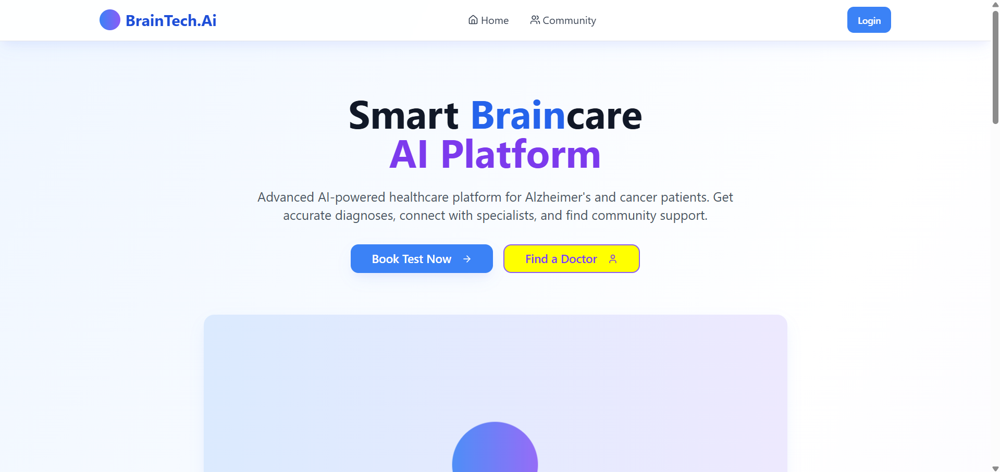
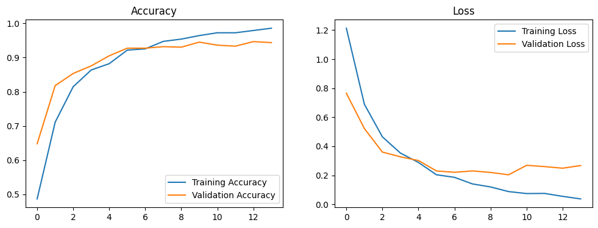
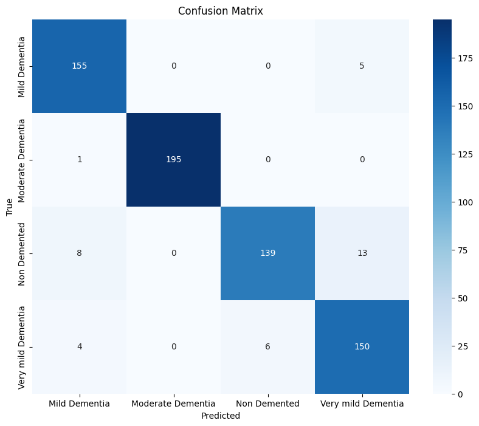

# BrainTech.AI – AI-Powered Dementia Diagnosis and Patient Management



## 🚀 About the Project
BrainTech.AI is an AI-driven healthcare platform that enables early-stage dementia detection through MRI scan analysis, provides doctors with clinical insights, and supports patient care workflows such as digital prescriptions and patient-doctor communication. Designed for practical clinical use, it combines precision AI diagnostics with tools that personalize treatment and track patient progress over time.

## 📌 Key Features
- 🧠 **AI-Based Dementia Detection** - Upload MRI brain scans to receive instant dementia classification with over 94% test accuracy across four dementia stages.

- 📊 **Per-Patient Personalization & Trend Analysis** - Each patient's scan history is visualized over time, enabling doctors to monitor dementia progression and make personalized treatment decisions.
  - → Live Demo: [mind-scan-report.vercel.app](https://mind-scan-report.vercel.app)
  - → GitHub: [github.com/Arittra-Bag/mind-scan-report](https://github.com/Arittra-Bag/mind-scan-report)

- 📑 **Clinical-Grade PDF Reports** - AI-generated insights are automatically compiled into detailed, readable medical PDFs to assist doctors in clinical decision-making.

- 👨‍⚕️ **Doctor Dashboard** - View patient profiles, past diagnoses, confidence trends, and medical notes all in one place.

- 📝 **Digital Prescription System** - Save, retrieve, and manage digital prescriptions, minimizing paper use and improving accessibility.

- 📖 **Awareness via Blogging** - Patients and caregivers can share experiences, encouraging community support and early diagnosis.

## 💡 Unique Selling Proposition (USP)
- Combines MRI classification, clinical insights, and patient care management into one cohesive system.
- Tracks dementia trends per patient across time—a feature absent in most standalone diagnostic tools.
- Enables doctors to take personalized action based on AI-generated PDFs and historical data.
- Easily integrates with modern hospital workflows; all outputs are digital, portable, and compliant-ready.

## 🥇 Competitive Advantage
While other tools provide static AI predictions, BrainTech.AI delivers:
- Actionable Insights over raw scores
- Longitudinal Tracking per patient
- Visual Analytics for better understanding disease progression
- Seamless Doctor Integration without disrupting existing hospital infrastructure

## 🏗️ Tech Stack
- **Frontend:** ReactJS
- **Backend:** Node.js, Flask
- **Database:** MongoDB Atlas
- **Model:** TensorFlow (Custom CNN)
- **AI Insight Generation:** Gemini API
- **Trend Extension App:** [mind-scan-report.vercel.app](https://mind-scan-report.vercel.app)

## 🎯 Model Performance

| Metric | Value |
|--------|-------|
| Test Accuracy | 94.53% |
| Test Loss | 0.2034 |
| F1-Score (Weighted) | 0.95 |
| MCC Score | 0.9273 |
| Cohen's Kappa | 0.9268 |
| ROC-AUC (Macro Avg) | 0.9910 |
| G-Mean Score | 0.9413 |

### Classification Report Summary

| Class | Precision | Recall | F1-Score |
|-------|-----------|--------|----------|
| Mild Dementia | 0.92 | 0.97 | 0.95 |
| Moderate Dementia | 1.00 | 0.99 | 1.00 |
| Non Demented | 0.96 | 0.87 | 0.91 |
| Very Mild Dementia | 0.89 | 0.94 | 0.91 |

Total Samples Evaluated: 676

### Visual Metrics
- #### Accuracy and Loss Curves

- #### Confusion Matrix


## ⚡ Installation & Usage
1. Clone the repository:
   ```sh
   git clone https://github.com/soumyajit73/braintech-compass-care.git
   cd BRAINTECH-COMPASS-CARE
   ```
2. Install dependencies:
   ```sh
   npm i
   ```
3. Run the application:
   ```sh
   npm run dev
   ```
4. Access the application in your browser

## 🏆 Mission & Vision
**Mission:** To provide an AI-driven healthcare solution that enables early dementia detection, simplifies medical consultations, and spreads awareness, ensuring better patient care and support.

**Vision:** To be a leading AI-powered dementia diagnosis and awareness platform, improving lives through technology and healthcare collaboration.

## 🔍 SWOT Analysis
### **Strengths:**
- High diagnostic accuracy with 95%+ performance metrics across dementia stages
- Personalized trend tracking per patient visit – a unique feature not offered by typical AI diagnostic tools
- Auto-generated clinical-grade PDF reports for real-world usability
- Scalable cloud infrastructure (MongoDB Atlas, Vercel) and API-ready architecture

### **Weaknesses:**
- Limited currently to MRI-based inputs (no CT or EEG integration yet)
- Regulatory and clinical validation required for deployment in public healthcare systems

### **Opportunities:**
- Integrate with EMR/HMS systems used in hospitals (e.g., Apollo, Fortis)
- Offer APIs to telemedicine platforms and diagnostic centers
- Expand into other neurodegenerative diseases and mental health diagnostics
- Multilingual support for Tier-2/3 adoption in emerging markets

### **Threats:**
- Competition from hospital-owned proprietary AI tools
- Data privacy and compliance (HIPAA/GDPR) challenges during scale-up
- Limited availability of high-quality, labeled MRI datasets

## 💰 Revenue and Growth Plan (Future)
### **Monetization Strategy (Post-MVP):**

#### B2B SaaS Model for Hospitals and Clinics
- Monthly/Annual Licensing for access to the platform
- Tiered pricing based on volume of scans, number of doctors, and analytics features

#### API-as-a-Service
- Services for diagnostic labs and telehealth providers per scan analysis via API (pay-per-use)

#### Hospital Integration Services
- Custom integrations with existing EMR/HMS using our API
- Optional on-premise deployments for larger hospital chains (data locality compliance)

#### Add-On Services
- White-labeled PDF reports for branding
- Doctor portals with advanced dashboards and analytics
- Enterprise plan with multi-location hospital access and admin tools

*Note: The current version is an MVP focused on validating core functionality and user experience. Monetization will be implemented in future iterations based on market feedback and adoption metrics.*

## 📌 Future Scope
- ✅ Enhancing AI model accuracy for better diagnostics
- ✅ Integration with wearable health monitoring devices
- ✅ Expansion into other neurodegenerative diseases

## 👨‍💻 Contributors
- **Arittra Bag** - Model Training, Integration & Backend
- **Soumyajit Datta** - Backend
- **Rudrasish Dutta** - Frontend

## 📜 License
This project is licensed under the MIT License - see the [LICENSE](LICENSE) file for details.

## ⭐ Support & Feedback
If you like this project, don't forget to ⭐ star the repository! Feel free to contribute or raise an issue for improvements. 🚀
